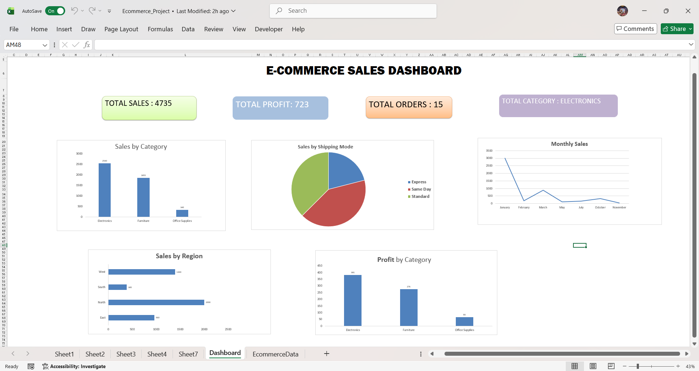

#  🛒 𝐄𝐂𝐎𝐌𝐌𝐄𝐑𝐂𝐄 𝐒𝐀𝐋𝐄𝐒 𝐃𝐀𝐒𝐇𝐁𝐎𝐀𝐑𝐃

## 📌 Project Overview

This project is an interactive **Excel E-Commerce Sales Dashboard** designed to analyze sales performance and provide business insights using Excel's data analysis features. The dashboard helps stakeholders monitor key performance indicators (KPIs), identify sales trends, and make data-driven decisions.

---

## 📷 Dashboard Preview

---

## ✨ Features

- 📊 Interactive Dashboard with Slicers
- 📈 Monthly Sales Trend Analysis
- 💰 Total Sales KPI
- 💵 Total Profit KPI
- 🛍️ Total Orders KPI
- 📦 Sales by Category
- 🌍 Sales by Region
- 🚚 Sales by Shipping Mode
- 📊 Profit by Category

---

## 🛠️ Tools & Skills Used

- Microsoft Excel
- Pivot Tables
- Pivot Charts
- Slicers
- Excel Formulas
- Conditional Formatting
- Dashboard Design
- Data Analysis

---

## 📊 Key Insights

- 📈 Electronics generated the highest overall sales.
- 🌍 The North region recorded the highest revenue.
- 🚚 Standard Shipping was the most preferred shipping mode.
- 💰 January achieved the highest monthly sales.
- 📉 Office Supplies contributed the lowest sales and profit.

---

## 🎯 Business Objective

The objective of this dashboard is to help business users:

- Monitor overall sales performance.
- Compare sales across categories and regions.
- Analyze monthly sales trends.
- Identify high-performing products and shipping methods.
- Support data-driven business decisions.

---

## 📁 Files Included

- `E-Commerce Sales Dashboard.xlsx` – Excel dashboard
- `Dashboard.png` – Dashboard screenshot
- `README.md` – Project documentation

---

## 🚀 Skills Demonstrated

- Data Cleaning
- Data Analysis
- Dashboard Development
- Business Intelligence
- KPI Reporting
- Data Visualization
- Excel Automation

---

## 👤 Author

**Chowdary Manju**

Aspiring **Data Analyst** passionate about Excel, Power BI, SQL, and Business Intelligence.

📌 Feel free to explore this project and share your feedback!
